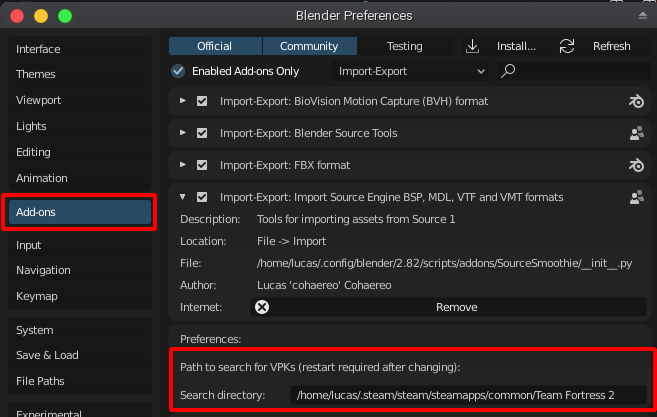

# SourceSmoothie

SourceSmoothie is a Blender 2.8 asset importer for Source Engine games (Source 1, not Source 2 and/or goldsrc).

## Features
| Feature         	| Ext  	| Supported?                    |
|-----------------	|------	|-----------------------------  |
| Maps            	| .bsp 	| WIP                           |
| Textures        	| .vtf 	| Windows, Linux: 👍, Mac: ❌    |
| Materials       	| .vmt 	| WIP        	                |
| Models          	| .mdl 	| WIP        	                |
| SFM Sessions  	| .dmx 	| ❌          	                |
| Demo Recordings 	| .dem 	| ❌          	                |

## Setup
After installing the addon, it's recommended that you set a path to search for VPKs. This can be done by going under preferences -> addons -> SourceSmoothie

## Credits
- [REDxEYE](https://github.com/REDxEYE), who I pretty much just stole the VTF importer from
- [Valve](https://www.valvesoftware.com) for creating amazing games